# Assignment 2

## PostgreSQL as SQL + NoSQL: Working with JSONB

**Name:** Sehaj Vohra

**SAP ID:** 590011624

**Course:** Backend Development

**Program:** B.Tech Computer Science and Engineering

**Semester:** 5

## Learning Objective

The objective of this assignment is to understand how PostgreSQL supports both relational SQL data and document style data using the `jsonb` data type. The assignment explores JSONB queries, JSONB indexing, updating JSONB data, and the use of PostgreSQL as both a SQL and NoSQL style database. The assignment also compares PostgreSQL JSONB with MongoDB in terms of syntax, transactions, joins, schema enforcement, and horizontal scaling.

---

# Part A: Conceptual Questions

## 1. What is `jsonb` in PostgreSQL, and how does it differ from the plain `json` type?

`jsonb` is a PostgreSQL data type used to store JSON data in a decomposed binary format. The plain `json` type stores the original JSON text, while `jsonb` parses the JSON when it is stored and uses an internal binary representation.

The `json` type preserves the original representation of the JSON text, including whitespace and the order of object keys. This can be useful when the original JSON representation needs to be retained. However, PostgreSQL has to process the JSON text when performing many operations.

`jsonb` can take slightly more time during insertion because PostgreSQL has to parse and convert the JSON into its binary representation. In exchange, `jsonb` generally provides faster querying and supports indexing, including GIN indexes.

Example:

```sql
SELECT attributes ->> 'author'
FROM products
WHERE attributes @> '{"pages": 464}';
```

Therefore, `json` is useful when preserving the original JSON text matters, while `jsonb` is generally more suitable when JSON data will be searched, filtered, or indexed frequently.

---

## 2. How can PostgreSQL work as both a SQL and a NoSQL database in the same table?

PostgreSQL can work as both a SQL and a NoSQL database by combining traditional relational columns with a `jsonb` column in the same table. The relational columns contain structured data with fixed data types and constraints, while the `jsonb` column stores flexible document style data whose structure can vary between rows.

An example schema is:

```sql
CREATE TABLE products (
    id INTEGER GENERATED ALWAYS AS IDENTITY PRIMARY KEY,
    name VARCHAR(100) NOT NULL,
    category VARCHAR(50) NOT NULL,
    price NUMERIC(10,2) NOT NULL,
    attributes JSONB
);
```

A book can contain an author and number of pages, while a laptop can contain RAM and CPU information. This allows PostgreSQL to provide SQL features such as constraints, joins, transactions, and typed columns while also providing document style flexibility through `jsonb`.

---

## 3. Give an example of a `jsonb` query using `->`, `->>`, `@>`, and `?`

Suppose the `attributes` column contains:

```json
{
    "author": "Robert C. Martin",
    "pages": 464,
    "language": "English"
}
```

The `->` operator extracts a JSON value:

```sql
SELECT attributes -> 'author' AS author
FROM products
WHERE name = 'Clean Code';
```

The `->>` operator extracts the value as text:

```sql
SELECT attributes ->> 'author' AS author
FROM products
WHERE name = 'Clean Code';
```

The `@>` operator checks JSONB containment:

```sql
SELECT name
FROM products
WHERE attributes @> '{"language": "English"}';
```

The `?` operator checks whether a key exists:

```sql
SELECT name
FROM products
WHERE attributes ? 'author';
```

The main difference between `->` and `->>` is that `->` returns a JSON value, while `->>` returns the extracted value as text.

---

## 4. How can a GIN index on a `jsonb` column change query performance?

A GIN index, or Generalized Inverted Index, can make searches involving JSONB data faster by creating an index structure that helps PostgreSQL locate rows containing particular JSON keys and values without examining every row.

Example:

```sql
CREATE INDEX idx_products_attributes
ON products USING GIN (attributes);
```

A containment query can then be written as:

```sql
SELECT name
FROM products
WHERE attributes @> '{"wireless": true}';
```

GIN indexes are particularly useful for JSONB containment and key or value existence queries.

However, PostgreSQL may still choose a sequential scan for a very small table because scanning a few rows can be cheaper than using an index. This was observed in this assignment because the table contained only five rows.

---

## 5. Where could PostgreSQL + `jsonb` replace a MongoDB deployment, and where would MongoDB still be the better fit?

PostgreSQL with `jsonb` can replace MongoDB when an application needs flexible document style data together with relational database features. PostgreSQL supports ACID transactions, foreign keys, joins, constraints, and strongly typed relational columns. JSONB can then be used for attributes that vary between records.

MongoDB can be a suitable fit for applications that primarily use document oriented data and require document based access throughout the application. MongoDB also provides horizontal scaling through sharding.

Therefore, the choice depends on the workload. PostgreSQL with JSONB is useful when relational integrity, transactions, joins, and flexible attributes are required together. MongoDB can be appropriate when document oriented access and large scale horizontal distribution are central requirements.

---

# Part B: Hands On Exercise: Product Catalog

## Task 1: Schema

The following SQL statement creates the `products` table containing fixed relational columns and one flexible JSONB column.

```sql
CREATE TABLE products (
    id INTEGER GENERATED ALWAYS AS IDENTITY PRIMARY KEY,
    name VARCHAR(100) NOT NULL,
    category VARCHAR(50) NOT NULL,
    price NUMERIC(10,2) NOT NULL,
    attributes JSONB
);
```

### Screenshot Evidence

The `products` table creation query was entered in pgAdmin.

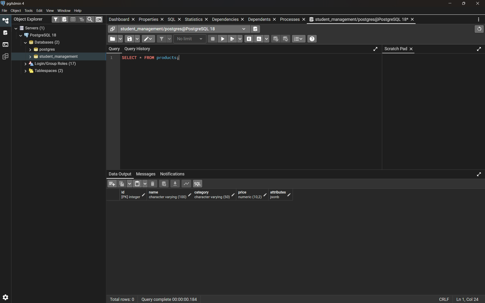

---

## Task 2: Insert Data

Five products were inserted across three categories. Each category uses different attribute keys inside the `attributes` JSONB column.

```sql
INSERT INTO products (name, category, price, attributes) VALUES
('Clean Code', 'book', 499.00,
    '{"author": "Robert C. Martin", "pages": 464, "language": "English"}'),

('The Pragmatic Programmer', 'book', 599.00,
    '{"author": "Andrew Hunt", "pages": 352, "language": "English"}'),

('Dell Inspiron 15', 'laptop', 65999.00,
    '{"ram_gb": 16, "cpu": "Intel Core i5", "storage_gb": 512}'),

('HP Pavilion 14', 'laptop', 72999.00,
    '{"ram_gb": 16, "cpu": "Intel Core i7", "storage_gb": 512}'),

('Wireless Mouse', 'accessory', 799.00,
    '{"color": "black", "wireless": true, "dpi": 1600}');
```

To verify the inserted records:

```sql
SELECT * FROM products;
```

The query displayed all five inserted products.

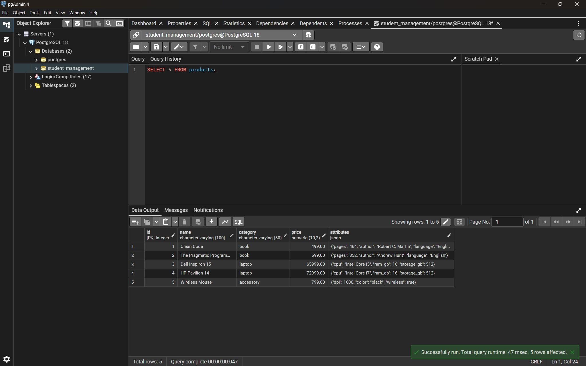

---

## Task 3: Query by Category Specific Attribute

### Book Query

Find books that have at least 400 pages.

```sql
SELECT name, attributes ->> 'author' AS author
FROM products
WHERE category = 'book'
  AND (attributes ->> 'pages')::int >= 400;
```

Result:

```text
Clean Code
Robert C. Martin
```

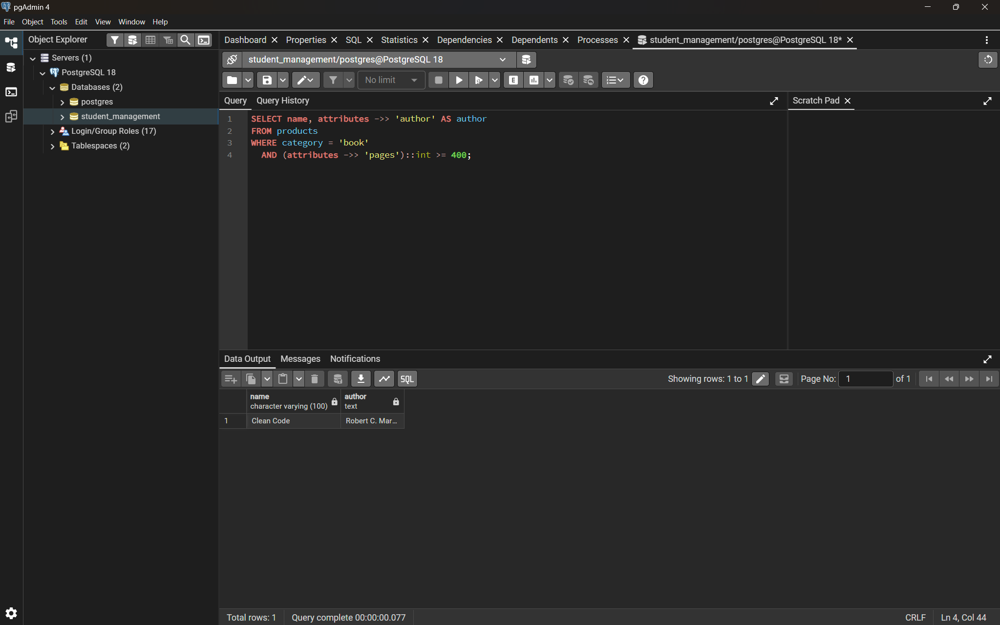

### Laptop Query

Find laptops with at least 16 GB of RAM.

```sql
SELECT name, attributes ->> 'cpu' AS cpu
FROM products
WHERE category = 'laptop'
  AND (attributes ->> 'ram_gb')::int >= 16;
```

Result:

```text
Dell Inspiron 15    Intel Core i5
HP Pavilion 14      Intel Core i7
```

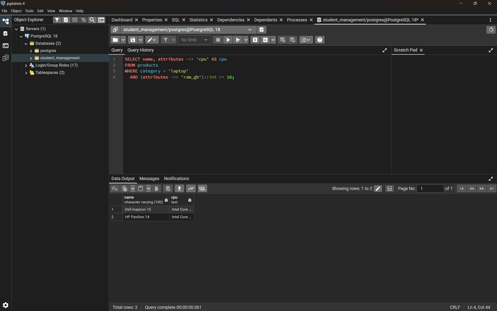

### Accessory Query

Find wireless accessories.

```sql
SELECT name, attributes ->> 'color' AS color
FROM products
WHERE category = 'accessory'
  AND (attributes ->> 'wireless')::boolean = true;
```

Result:

```text
Wireless Mouse    black
```

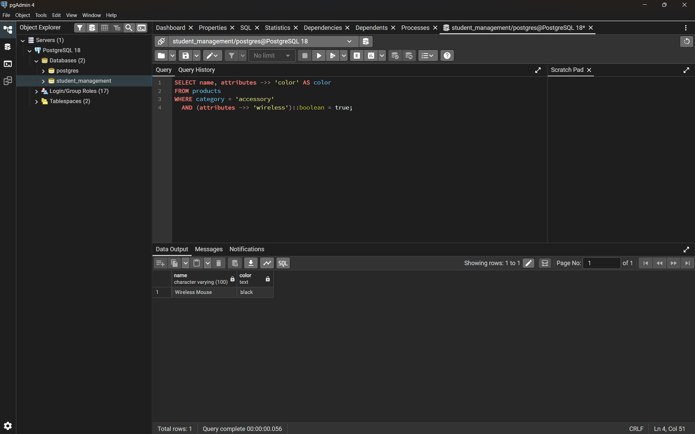

---

## Task 4: Containment Query

The `@>` operator checks whether the JSONB value on the left contains the JSONB value on the right.

```sql
SELECT name
FROM products
WHERE attributes @> '{"wireless": true}';
```

Result:

```text
Wireless Mouse
```

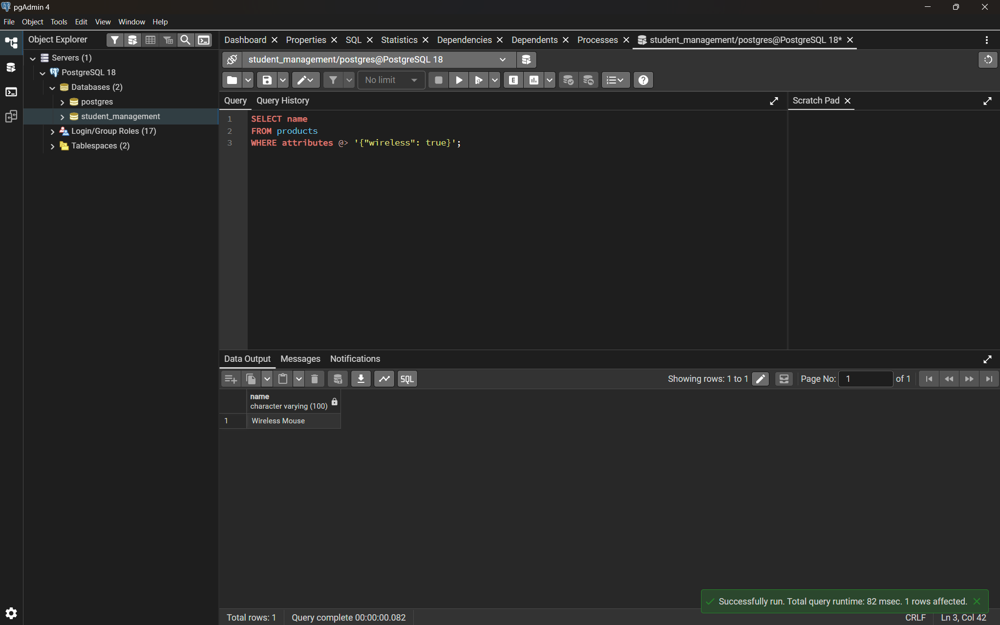

---

## Task 5: Update JSONB Without Altering the Table

A new attribute can be added to an existing JSONB object without changing the table structure.

```sql
UPDATE products
SET attributes = attributes || '{"discount_pct": 10}'
WHERE name = 'Wireless Mouse';
```

Verify the updated record:

```sql
SELECT name, attributes
FROM products
WHERE name = 'Wireless Mouse';
```

The resulting JSONB data contains the new `discount_pct` attribute.

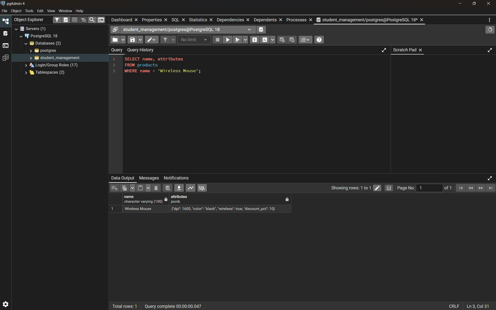

---

# Task 6: Index and Compare

First, the containment query was executed before creating the GIN index.

```sql
EXPLAIN ANALYZE
SELECT name
FROM products
WHERE attributes @> '{"wireless": true}';
```

The query plan obtained before creating the index used a sequential scan:

```text
Seq Scan on products
Filter: (attributes @> '{"wireless": true}'::jsonb)
Rows Removed by Filter: 4
Buffers: shared hit=1
Planning Time: 0.081 ms
Execution Time: 0.040 ms
```

Because the table contains only five rows, PostgreSQL selected a sequential scan.

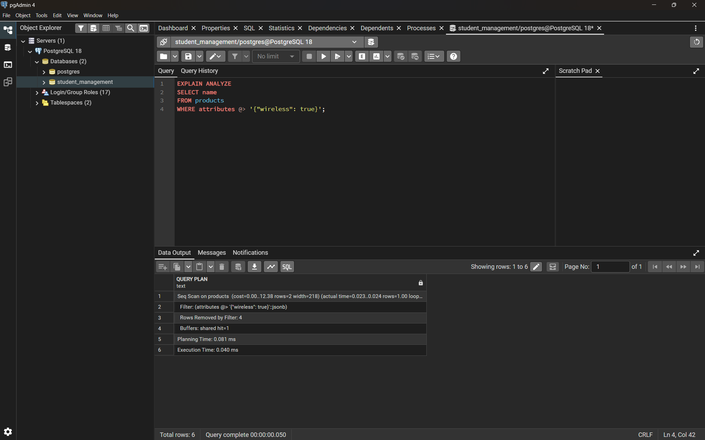

---

## Create the GIN Index

```sql
CREATE INDEX idx_products_attributes
ON products USING GIN (attributes);
```

The index was created successfully.

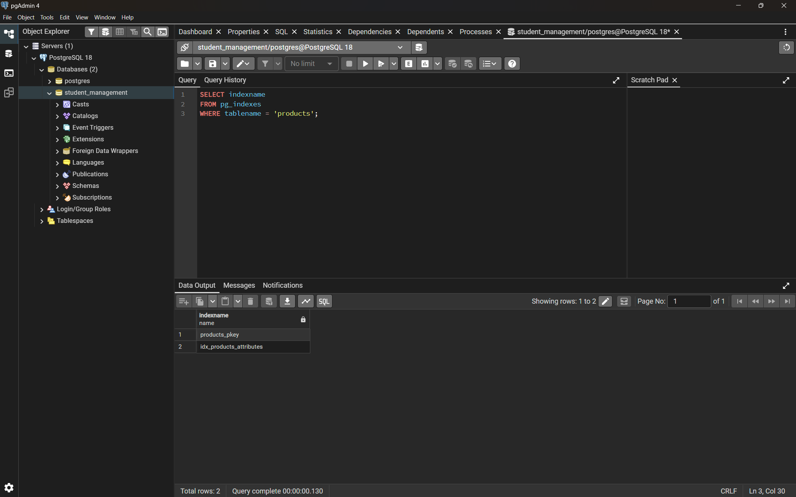

---

## EXPLAIN ANALYZE After Creating the Index

The same query was executed again:

```sql
EXPLAIN ANALYZE
SELECT name
FROM products
WHERE attributes @> '{"wireless": true}';
```

The query still used a sequential scan because the table is very small.

The observed execution time after creating the index was approximately `0.037 ms`.

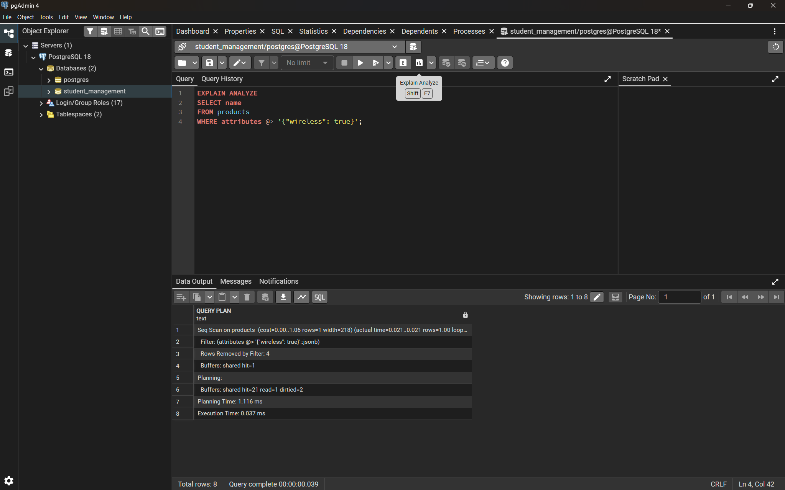

This demonstrates that creating an index does not guarantee that PostgreSQL will use it for every query. The query planner chooses the execution plan based on estimated cost.

---

# Task 7: MongoDB Comparison

The same five products were recreated as documents in a MongoDB `products` collection.

## MongoDB Connection

MongoDB was accessed using `mongosh`.


---

## Insert Documents

The following documents were inserted into the `products` collection:

```javascript
use product_catalog

db.products.insertMany([
    {
        name: "Clean Code",
        category: "book",
        price: 499.00,
        attributes: {
            author: "Robert C. Martin",
            pages: 464,
            language: "English"
        }
    },
    {
        name: "The Pragmatic Programmer",
        category: "book",
        price: 599.00,
        attributes: {
            author: "Andrew Hunt",
            pages: 352,
            language: "English"
        }
    },
    {
        name: "Dell Inspiron 15",
        category: "laptop",
        price: 65999.00,
        attributes: {
            ram_gb: 16,
            cpu: "Intel Core i5",
            storage_gb: 512
        }
    },
    {
        name: "HP Pavilion 14",
        category: "laptop",
        price: 72999.00,
        attributes: {
            ram_gb: 16,
            cpu: "Intel Core i7",
            storage_gb: 512
        }
    },
    {
        name: "Wireless Mouse",
        category: "accessory",
        price: 799.00,
        attributes: {
            color: "black",
            wireless: true,
            dpi: 1600
        }
    }
])
```

The documents were verified using:

```javascript
db.products.find().pretty()
```

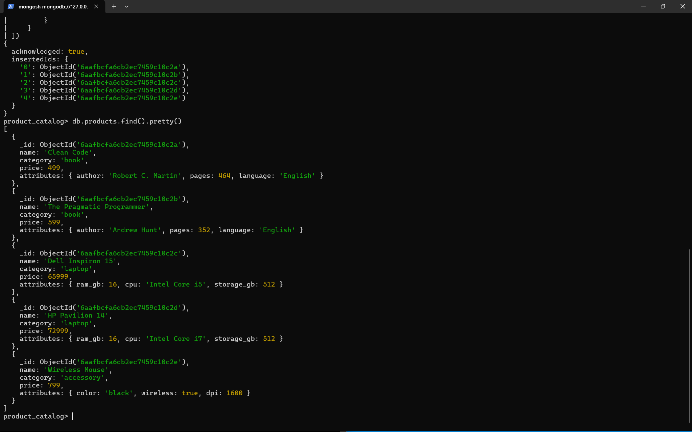

---

## MongoDB Book Query

Find books with at least 400 pages:

```javascript
db.products.find(
    {
        category: "book",
        "attributes.pages": { $gte: 400 }
    },
    {
        name: 1,
        "attributes.author": 1,
        _id: 0
    }
)
```

Result:

```text
Clean Code
Robert C. Martin
```

---

## MongoDB Laptop Query

Find laptops with at least 16 GB of RAM:

```javascript
db.products.find(
    {
        category: "laptop",
        "attributes.ram_gb": { $gte: 16 }
    },
    {
        name: 1,
        "attributes.cpu": 1,
        _id: 0
    }
)
```

Result:

```text
Dell Inspiron 15    Intel Core i5
HP Pavilion 14      Intel Core i7
```

The MongoDB shell screenshot shows the successful book and laptop queries.


---

## MongoDB Accessory Query

Find wireless accessories:

```javascript
db.products.find(
    {
        category: "accessory",
        "attributes.wireless": true
    },
    {
        name: 1,
        "attributes.color": 1,
        _id: 0
    }
)
```

Result:

```text
Wireless Mouse    black
```

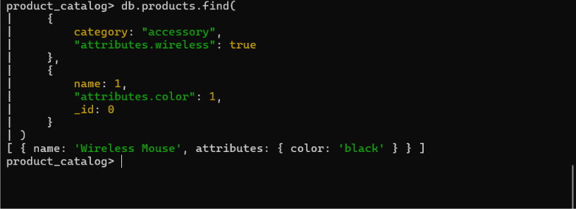

---

# PostgreSQL and MongoDB Comparison

| Feature | PostgreSQL with JSONB | MongoDB |
| --- | --- | --- |
| Data model | Relational tables with JSONB documents | Document oriented |
| Fixed columns | Strongly typed columns are available | Document fields are flexible |
| Flexible attributes | Supported through JSONB | Native document structure |
| Query language | SQL with JSONB operators | MongoDB query syntax |
| Transactions | Strong transactional support | Supports transactions |
| Joins | Native SQL joins | Uses document embedding, `$lookup`, and other mechanisms |
| Schema enforcement | Strong relational constraints can be applied to fixed columns | Flexible schema by default, with validation available |
| JSON document access | JSONB operators such as `->`, `->>`, `@>`, and `?` | Dot notation and MongoDB query operators |
| JSON indexing | GIN and other suitable indexes | MongoDB indexes on document fields |
| Horizontal scaling | PostgreSQL can be scaled horizontally using additional technologies and PostgreSQL ecosystem solutions | Horizontal scaling through sharding |
| Best suited to | Applications needing relational integrity together with flexible JSON data | Applications primarily designed around document oriented data |

## Syntax Difference

PostgreSQL uses SQL with JSONB operators:

```sql
SELECT name, attributes ->> 'cpu' AS cpu
FROM products
WHERE category = 'laptop'
  AND (attributes ->> 'ram_gb')::int >= 16;
```

MongoDB uses dot notation to access nested document fields:

```javascript
db.products.find({
    category: "laptop",
    "attributes.ram_gb": { $gte: 16 }
})
```

The PostgreSQL query uses SQL and JSONB operators, while MongoDB uses document query syntax.

---

# Conclusion

This assignment demonstrated how PostgreSQL can combine relational SQL features with flexible document style data using the `jsonb` data type. Fixed columns such as `id`, `name`, `category`, and `price` provide structure and typed data, while the `attributes` column allows different categories of products to store different properties.

The practical work demonstrated JSONB creation, insertion, extraction, filtering, containment queries, JSONB updates, GIN indexing, and query plan analysis. The same product data was then implemented in MongoDB to demonstrate the difference between PostgreSQL JSONB queries and MongoDB document queries.

The screenshots included in this document provide evidence of the PostgreSQL and MongoDB practical work.
